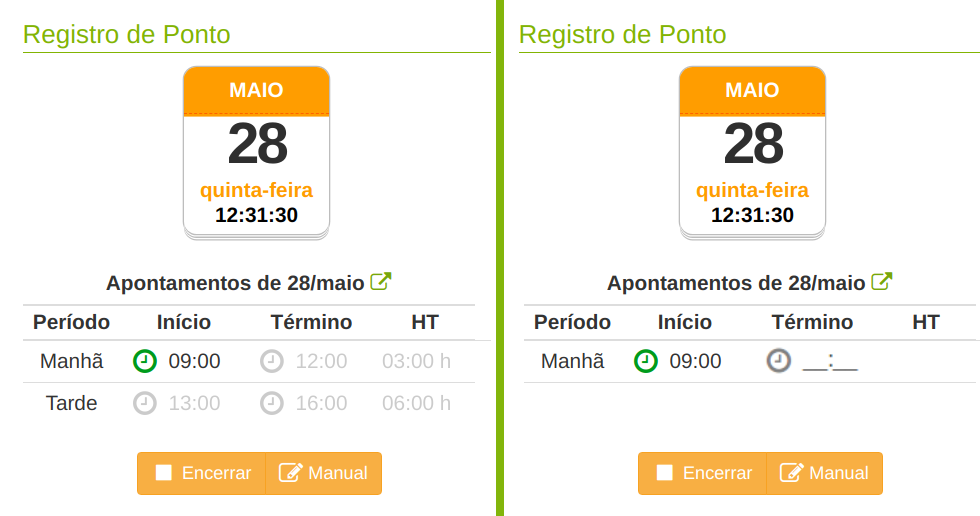

# Better Trading Works

Extensão para browsers Chromium-based que sugere a melhor hora para bater o ponto no Trading Works.

  
  
  
Com a extensão | sem a extensão

## Instalação

Baixar o pacote disponível no release deste repositório, clicando [aqui](https://github.com/jviriato/better-trading-works/releases/tag/v0.0.1-alpha)

## Desenvolvimento

Para compilar, execute o comando:
>npm run build

# 
